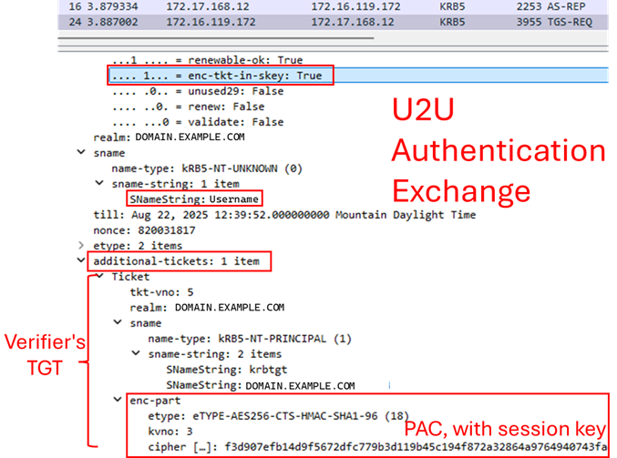
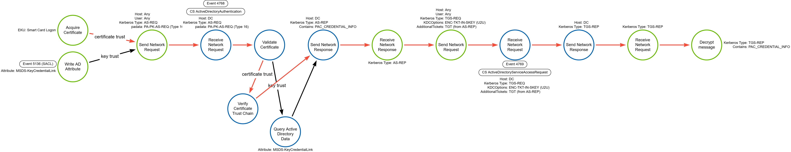
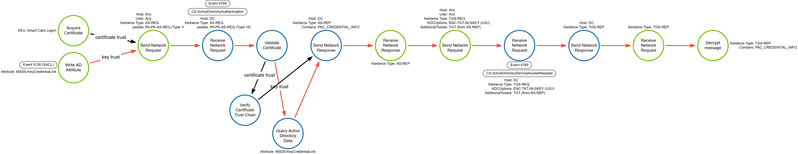

# UnPAC-the-Hash

## Metadata

| Key          | Value                                      |
|--------------|--------------------------------------------|
| ID           | TRR0000                                    |
| External IDs | [T1555]                                    |
| Tactics      | Credential Access                          |
| Platforms    | Windows                                    |
| Contributors | Andrew VanVleet, Chris Hodson              |

### Scope Statement

This TRR addresses the technique known as "UnPAC-the-Hash," which is a mechanism
for retrieving a user's NTLM hash if you have a valid authentication certificate
or private/public key pair for them. There are many ways for an attacker to
obtain a valid certificate for a user, including misconfigurations in the
certificate request process, certificate template permissions, collecting
existing certificates from local certificate stores, or forging certificates.
Many of these fall under the technique T1649 *Steal or Forge Authentication
Certificate*.

## Technique Overview

Adversaries can retrieve a user's NTLM hash by combining a valid authentication
certificate with Kerberos' User-to-User (U2U) feature to be issued a ticket
encrypted with a known key, allowing the attacker to decrypt the Privilege
Attribute Certificate (PAC) and retrieve the user's password hash. An NTLM hash
can be cracked offline or used in lateral movement techniques like pass-the-hash
attacks (T1550.002).

## Technical Background

### Public Key Infrastructure (PKI)

Public Key Infrastructure (PKI) is a framework of technologies, policies, and
procedures that uses cryptographically-signed digital certificates to allow
entities to authenticate with one another and securely exchange information. PKI
relies on asymmetric cryptography, which uses a pair of keys: a public key that
can be shared openly and a private key that should only be known by the owner.

At the core of PKI is the concept of **digital certificates**, which are issued
by trusted entities called **Certificate Authorities (CAs)**. A digital
certificate binds a public key to an entity (such as a person, organization, or
device) and includes identifying information like the entity's name and the
certificate's validity period. These certificates follow the `X.509` standard
and are commonly referred to as `X.509 certificates`. The PKI process typically
involves several components: the CA, a Registration Authority (RA) that verifies
identities before certificates are issued, and a Certificate Repository where
certificates and revocation lists are stored.

When one party is attempting to validate the identity of another via PKI, the
second party presents its certificate to the first. The first party verifies
that the certificate was signed by a trusted CA (using the CA's public key to
validate the signature) and that the certificate hasn't expired or been revoked.
If everything checks out, the first party accepts the identity of the second
party. If information needs to be exchanged (like browsing a secure website),
both parties will exchange keys to establish an encrypted session.

### Extended Key Usages (EKUs)

`X.509 certificates` contain an Extended Key Usage (EKU) field that describes
the specific uses permitted for the certificate. The CA sets the EKUs when the
certificate is created. Common EKU OIDs include:

- Code Signing (OID 1.3.6.1.5.5.7.3.3) - The certificate is for signing
executable code.
- Encrypting File System (OID 1.3.6.1.4.1.311.10.3.4) - The certificate is for
encrypting file systems.
- Secure Email (1.3.6.1.5.5.7.3.4) - The certificate is for encrypting email.
- Client Authentication (OID 1.3.6.1.5.5.7.3.2) - The certificate is for
authentication to another server (e.g., to AD).
- Smart Card Logon (OID 1.3.6.1.4.1.311.20.2.2) - The certificate is for use in
smart card authentication.
- Server Authentication (OID 1.3.6.1.5.5.7.3.1) - The certificate is for
identifying servers (e.g., HTTPS certificates).

### Kerberos Protocol

Kerberos is a network authentication protocol designed to provide authentication
for client/server applications by using symmetric key cryptography to sign
'tickets' that a client can use to prove their identity and authorization to
access a network resource. An authentication request in Kerberos consists of a
series of exchanges between a client, the authentication server (also called a
Key Distribution Center, or KDC), and the application server (AS).

1. **AS-REQ**: The client authenticates to the AS with a username and password.
By default in a Windows domain, pre-authentication data is also included in the
form of a current timestamp encrypted with the user's secret key (derived from
the windows password).  
2. **AS-REP**: The KDC validates the client's credentials, then sends back a
TGT. The TGT contains the Privilege Attribute Certificate (PAC), which includes
the symmetric user session key that is used in subsequent steps to encrypt
communications with the KDC. The TGT also contains the username that it was
issued for and an expiration timestamp. Note that the client cannot read the
encrypted portions of the TGT because it does not have the KDC's encryption key.
The `AS-REP` also contains the session key and expiration time encrypted with
the user's hash, which the client can read. At this point, the client has a
session key that it decrypted using the user's secret key and the TGT (which
contains the same session key, encrypted with the KDC's secret key).
3. **TGS-REQ**: When the client wants access to a specific resource, it presents
the TGT to the KDC's Ticket Granting Service (TGS) in a message that also
contains the service principal name (SPN) of the service it wants to access. The
request is encrypted using the user's session key, obtained from the `AS-REP`
message earlier.
4. **TGS-REP**: The KDC opens the TGT and validates the PAC checksum. If
successful, it proceeds to create a service ticket that contains the PAC. A
symmetric key is generated for use between the client and the requested service
(the service session key). The service ticket is encrypted with the service's
password hash. The service ticket and the service session key are encrypted a
second time using the user's session key and sent to the client.
5. **AP-REQ**: Client decrypts the service ticket and service session key from
the `TGS-REP` message and sends the service ticket to the server hosting the
desired resource. The client also includes an authenticator message generated by
the client and encrypted with the service session key.
6. The Application Server decrypts the service ticket (using its own password
hash) and extracts the service session key. It then decrypts the authenticator
using the service session key. The Application Server extracts the PAC from the
service ticket and grants the client access to the resource.  
7. **AP-REP** (optional): If mutual authentication is needed, it can send back
an optional `AP-REP` message.
8. **PAC Validation**: In the AD implementation of Kerberos, if the TGT is older
than 20 minutes, the AP will send a PAC Validation message to the KDC to verify
that the PAC's information is valid.

### PKI in Kerberos (PKINIT)

PKINIT is a pre-authentication mechanism for Kerberos that uses `X.509
certificates` instead of passwords to authenticate clients. Microsoft's
implementation is the "Public Key Cryptography for Initial Authentication
(PKINIT) in Kerberos Protocol" [MS-PKCA]. Certificates must have the Smart Card
Logon EKU in order to be used to authenticate a client using PKINIT (unless the
"Allow certificates with no extended key usage certificate attribute" group
policy is enabled, in which case any certificate will be accepted[^1]).

The `MS-PKCA` protocol specifies that authentication requests using PKINIT
include a special [PA-PK-AS-REQ] data structure in the pre-authentication data
section (the `padata` field of the `AS-REQ` message) that includes the
certificate.

In order to support NTLM authentication for clients connecting to applications
that do not support Kerberos authentication, under `MS-PKCA` the KDC returns the
user's NTLM password hash in the privilege attribute certificate's (PAC's)
[PAC_CREDENTIAL_INFO] buffer.[^2] Normally, this structure is encrypted using
the session's encryption key, found in the `AS-REP` message. However, the
User-to-User (U2U) authentication protocol can specify a different encryption
key.

### The Privileged Attribute Certificate (PAC)

The Kerberos protocol does not define any explicit group membership or logon
policy information to be carried in Kerberos tickets; applications are expected
to manage their own authorization. The [PAC][Privileged Attribute Certificate -
Microsoft Learn] was created to provide this authorization data for Active
Directory domains. Active Directory's implementation of Kerberos always includes
a PAC. This is included in the TGT and is typically signed with the KDC's
encryption key. The PAC contains the session key and information about the
user's privileges in the domain. The PAC is included in the service ticket,
which is encrypted with the service's key in an `AS-REP` message to allow the
service to grant access as dictated in the PAC.

### User-to-User (U2U) Authentication

User-to-User (U2U) authentication provides a method to perform authentication
when the verifier (i.e. the service) does not have a access to a long-term
service key or an SPN. This might be the case when running a server as a user on
a workstation or when running a peer-to-peer application, for example.

To address this problem, the Kerberos protocol allows a client to request that
the ticket issued by the KDC be encrypted using a session key from a TGT issued
to the party that will verify the authentication (again, usually the application
server). This TGT must be obtained from the verifier by some means external to
the Kerberos protocol prior to requesting U2U authentication.

> [!NOTE]
>
> The client cannot use the verifier's TGT to impersonate the verifier because
> they do not have the session key, which would be used to encrypt the `TGS-REQ`
> message. Knowledge of the session key is how a client proves a TGT belongs to
> them.

When the client sends its service ticket request message to the KDC, it includes
the verifying server's TGT as an additional ticket (using the
`additional-tickets` section) and sets the `ENC-TKT-IN-SKEY` flag to `True`.
After validating the request, the KDC will encrypt the service ticket with the
session key contained in the verifier's TGT. The client will then submit the
service ticket to the application server, setting the `USE-SESSION-KEY` flag in
the `ap-options` field. The verifying server will be able to decrypt the service
ticket because it can decrypt its own TGT and obtain the session key, which can
be used to decrypt the PAC.

### UnPAC the Hash

This technique takes advantage of `MS-PKCA's` fallback NTLM support to ensure
that the KDC includes the target user's NTLM hash in a TGT. This is accomplished
by authenticating to Kerberos using a certificate. It then uses that TGT in a
U2U request to obtain a service ticket encrypted with a known key, allowing the
attacker to decrypt the ticket and obtain the user's NTLM hash.

*Image source: [UnPAC the Hash - The Hacker Recipes]*

### Logging

Windows generates two events relevant to this activity:

- Event 4768: A Kerberos authentication ticket (TGT) was requested.
- Event 4769: A Kerberos service ticket was requested.

In event 4768, there will be a `Pre-Authentication Type` field that indicates
some of the pre-authentication data structures that can be included in
an`AS-REQ` message. Type `16` shows that a `PA-PK-AS-REQ` structure was present,
indicating that it was a logon using PKINIT. When a certificate is used for
authentication, the log will also include information about the certificate
issuer, serial number, and thumbprint.

In event 4769, the `Ticket Options` field will have `bit 28` set (this will be
`0x8` when using bitwise operations, due to the use of `most significant bit 0`
numbering). Remember that any other bits could also be set, so the actual
`Ticket Options` value can differ.

## Procedures

| ID                   | Title                   | Tactic            |
|----------------------|-------------------------|-------------------|
| TRR0000.WIN.A        | Certificate + U2U       | Credential Access |
| TRR0000.WIN.B        | Key Trust + U2U         | Credential Access |

### Procedure A: Certificate + U2U

This procedure uses a certificate issued by a trusted central CA, such as AD CS,
for the PKINIT logon. The DC ensures the certificate chains to a trusted root
certificate, is within its validity period, can be used for authentication, and
hasn't been revoked. It retrieves the public key and user principal name (UPN)
from the certificate and matches the UPN with one in Active Directory. It
validates the signed pre-authentication data using the public key from the
certificate.[^4]

#### Detection Data Model

This DDM has been simplified for clarity. The lower level networking details
have been omitted, keeping the DDM focused at the Kerberos protocol application
layer.

### Procedure B: Key Trust + U2U

This procedure is very similar to procedure A, but it uses Windows Hello for
Business's (WHfB) Key Trust[^3] to perform the PKINIT logon instead of a
certificate. With the creation of WHfB, Microsoft introduced the concept of Key
Trust to support passwordless authentication in environments that don't support
certificate trust. Key Trust makes it possible to use certificate-based
authentication without actually issuing certificates.

This is done by creating a public/private key pair during WHfB device
registration and storing the public key in a multi-value attribute called
`msDS-KeyCredentialLink` in the user's Active Directory profile. (It is a
multi-value attribute because an account can have several linked devices.) The
values of this attribute are serialized objects containing information like the
creation date, the distinguished name of the owner, a device ID (a GUID), and
the public key. When using WHfB device enrollment, the private key is stored in
the Trusted Platform Module (TPM).

> [!Note]
>
> If an attacker gains access to an account with permission to write to the
> `msDS-KeyCredentialLink` attribute, they can add a private/public key pair
> that they control and use it to authenticate as that account. This is called a
> [Shadow Credentials][Shadow Credentials - Elad Shamir] attack. This procedure
> enables an attacker who has successfully added a "shadow credential" to
> retrieve the user's NTLM hash.

When a client logs in, it signs the pre-authentication data with the private key
and sends the signed pre-authentication data and its public key (in the form of
a self-signed certificate) to the DC. The DC determines that the certificate is
self-signed, retrieves the public key from the certificate, and searches for the
matching public key in Active Directory. It validates that the UPN in the
authentication request matches the UPN registered in Active Directory and
validates the signed pre-authentication data using the public key from Active
Directory.[^5]

> [!Note]
>
> When using Key Trust, the DC only validates that the client UPN in the
> `AS-REQ` message matches the UPN in AD with an `msDS-KeyCredentialLink`
> attribute that contains the matching public key. It also verifies that the
> public key can decrypt the pre-authentication data provided in the `AS-REQ`.
> All other elements of the self-signed certificate, like the subject, signer,
> UPN, etc, are ignored.

#### Detection Data Model

This DDM has been simplified for clarity. The lower level networking details
have been omitted, keeping the DDM focused at the Kerberos protocol application
layer.

## Available Emulation Tests

| ID            | Link             |
|---------------|------------------|
| TRR0000.WIN.A |                  |
| TRR0000.WIN.B |                  |

## References

- [Certified Pre-Owned - SpecterOps]
- [Public Key Infrastructure - Wikipedia]
- [Privileged Attribute Certificate - Microsoft Learn]
- [X.509 Certificates - Wikipedia]
- [MS-PKCA - Microsoft Learn]
- [Attacking Smart Card-based AD Networks - ethicalchaos.dev]
- [PKINIT Tools - GitHub]
- [Shadow Credentials - Elad Shamir]

[^1]: [Attacking Smart Card-based AD Networks]
[^2]: [MS-PKCA Relationship to Other Protocols]
[^3]: [Windows Hello for Business Key Trust]
[^4]: [Windows Hello for Business Certificate Trust Authentication]
[^5]: [Windows Hello for Business Key Trust Authentication]

[UnPAC the Hash - The Hacker Recipes]:  https://www.thehacker.recipes/ad/movement/kerberos/unpac-the-hash
[MS-PKCA - Microsoft Learn]: https://learn.microsoft.com/en-us/openspecs/windows_protocols/ms-pkca/d0cf1763-3541-4008-a75f-a577fa5e8c5b
[MS-PKCA Relationship to Other Protocols]: https://learn.microsoft.com/en-us/openspecs/windows_protocols/ms-pkca/4e5fb325-eabc-4fac-a0da-af2b6b4430cb
[PA-PK-AS-REQ]: https://learn.microsoft.com/en-us/openspecs/windows_protocols/ms-pkca/8270b791-0201-4231-9d89-e5074459be2f
[PAC_CREDENTIAL_INFO]: https://learn.microsoft.com/en-us/openspecs/windows_protocols/ms-pac/cc919d0c-f2eb-4f21-b487-080c486d85fe
[Certified Pre-Owned - SpecterOps]: https://specterops.io/wp-content/uploads/sites/3/2022/06/Certified_Pre-Owned.pdf
[Public Key Infrastructure - Wikipedia]: https://en.wikipedia.org/wiki/Public_key_infrastructure
[Privileged Attribute Certificate - Microsoft Learn]: https://learn.microsoft.com/en-us/openspecs/windows_protocols/ms-pac/1d4912dd-5115-4124-94b6-fa414add575f
[Attacking Smart Card-based AD Networks - ethicalchaos.dev]: https://ethicalchaos.dev/2020/10/04/attacking-smart-card-based-active-directory-networks/
[X.509 Certificates - Wikipedia]: https://en.wikipedia.org/wiki/X.509
[PKINIT Tools - GitHub]: https://github.com/dirkjanm/PKINITtools/tree/master
[Windows Hello for Business Key Trust]: https://learn.microsoft.com/en-us/windows/security/identity-protection/hello-for-business/deploy/#trust-types
[Windows Hello for Business Certificate Trust Authentication]: https://learn.microsoft.com/en-us/windows/security/identity-protection/hello-for-business/how-it-works-authentication#microsoft-entra-join-authentication-to-active-directory-using-a-certificate
[Windows Hello for Business Key Trust Authentication]: https://learn.microsoft.com/en-us/windows/security/identity-protection/hello-for-business/how-it-works-authentication#microsoft-entra-join-authentication-to-active-directory-using-a-key
[T1555]: https://attack.mitre.org/techniques/T1555
[Shadow Credentials - Elad Shamir]: https://eladshamir.com/2021/06/21/Shadow-Credentials.html
