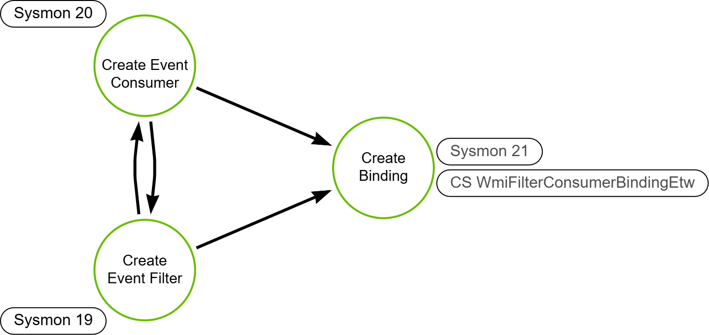

# WMI Event Subscription

## Metadata

| Key          | Value                          |
|--------------|--------------------------------|
| ID           | TRR0027                        |
| External IDs | [T1546.003]                    |
| Tactics      | Persistence                    |
| Platforms    | Windows                        |
| Contributors | Andrew VanVleet                |

## Technique Overview

Cyber threat actors can use the WMI event subscription framework to run
arbitrary code when specific attacker-defined conditions are met, allowing them
to establish persistence on a compromised system.

## Technical Background

### Windows Management Instrumentation (WMI)

Windows Management Instrumentation (WMI) is the infrastructure for management
data and operations on Windows-based operating systems. It's Microsoft's
implementation of the Web-Based Enterprise Management (WBEM) and Common
Information Model (CIM) standards. WMI provides a uniform (standard) way of
representing elements of an IT environment as a common set of related objects on
the Windows operating system.

The following diagram illustrates the WMI architecture and infrastructure
components:


The main elements of WMI are:

1. WMI Infrastructure
2. Managed Objects and their Providers
3. Consumers and Consumer APIs

#### WMI Infrastructure

The infrastructure implementing WMI has two components: The WMI Core (also
called the the WMI service), and the WMI repository.

- The WMI repository holds static information about objects, such as the classes
defined by providers. It is organized into namespaces. The WMI service creates
some namespaces at system startup, such as `root\default`, `root\cimv2`, and
`root\subscription`. It also pre-installs a default set of class definitions,
including the `Win32`classes and the `WMI System` classes. The remaining
namespaces are created by providers for other parts of the operating system or
products. The default location for the repository is
`%windir%\System32\wbem\Repository`.
- The WMI service (also called the CIM Object Manager) acts as an intermediary
between providers, consumers, and the repository. The WMI service starts when
the first management application or script makes a call to connect to a WMI
namespace. If a request involves static data, such as the name of a managed
object, the WMI service retrieves the data from the repository. If the request
involves dynamic data, such as the amount of memory a managed object is
currently using, the service passes the request on to a provider. This service
is called `Winmgmt` (display name is `Windows Management Instrumentation`) and
is hosted in a shared host process (`svchost.exe`). It is implemented in the DLL
`%windir%\System32\wbem\WMIsvc.dll`.

#### Managed Objects and their Providers

A managed object is a logical or physical system component, such as a hard disk
drive, network adapter, database system, operating system, process, or service.

A WMI provider is a COM object that monitors one or more managed objects for
WMI. Similar to a driver, a provider supplies WMI with data from a managed
object and handles messages between WMI and the managed object. WMI providers
consist of a DLL file and a Managed Object Format (MOF) file that defines the
classes for which the provider returns data and performs operations. WMI
Provider MOF and DLL files are located in `%WINDIR%\System32\Wbem`. Provider
classes, such as `Win32_LogicalDisk`, are defined in MOF files and then compiled
into the WMI repository at system startup, while DLL files hold the code that
queries the managed object for dynamic data.

Providers register their location with the WMI service, which allows WMI to
route data requests. A provider also registers support for particular
operations, such as data retrieval, modification, deletion, enumeration, or
query processing. The WMI service uses the provider registration information to
match application requests with the appropriate provider. WMI also uses the
registration information to load and unload providers, as necessary. When a
provider finishes processing a request, the provider returns the result back to
the WMI service, which forwards it on to the requesting consumer. Providers use
the COM API for WMI to interact with the WMI service.

An example of a provider is the pre-installed Registry provider, which accesses
data in the system registry. The Registry provider has one WMI class,
[StdRegProv], with many methods but no properties. (By comparison, the [Win32
provider] has classes that usually have many properties but few methods, such as
`Win32_Process` or `Win32_LogicalDisk`.) The Registry provider DLL,
`Stdprov.dll`, contains the code that queries the registry to return dynamic
data when requested by client scripts or applications.

#### Consumers and Consumer APIs

A WMI consumer is an application or script that interacts with the WMI
infrastructure. Consumers can query providers, enumerate data, run provider
methods, or subscribe to events by calling either the COM API for WMI or the
Scripting API for WMI.

- The [COM API for WMI] is the primary mechanism for interacting with WMI. It
  can be used to write consumer applications or implement new WMI providers.
- The [Scripting API for WMI] enables quick, simple interactions with WMI from
  any scripting language that can interact with ActiveX objects, for example,
  PowerShell and Visual Basic.

### WMI Event Subscriptions

Windows has [hundreds of WMI event providers], which report on a wide range of
things happening on the operating system, including things like new processes,
registry modifications, hardware utilization, Windows Defender scans or alerts,
etc. The WMI framework provides a set of objects that can be used to create
subscriptions for any combination of those events and to take actions based on a
subscription. These objects are stored in the `root\subscription` namespace.
These objects are:

#### Event Filters

Filters are defined using a query language. They are used to select a very
specific set of event conditions. As an example a filter could be created to
catch the creation of a process meeting specific naming conditions, or the
system uptime reaching a certain number of minutes, or the processor exceeding a
specific percentage of utilization.

#### Event Consumers

Event consumers provide the action to take when a filter's conditions are met.
WMI Event Consumers come in a number of different varieties, some more easily
abused than others. `ActiveScriptEventConsumers` and `CommandLineEventConsumers`
are the most easily used for malicious purposes because both allow arbitrary
payloads. The following table identifies the most common types of event
consumers.

| Class | Description |
| --- | --- |
| ActiveScriptEventConsumer | Executes a predefined script in an arbitrary scripting language when an event is delivered to it. Example: [Running a Script Based on an Event] |
| CommandLineEventConsumer | Launches an arbitrary process in the local system context when an event is delivered to it. Example: [Running a Program from the Command Line Based on an Event] |
| LogFileEventConsumer | Writes customized strings to a text log file when events are delivered to it. Example: [Writing to a Log File Based on an Event] |
| NTEventLogEventConsumer | Logs a specific message to the Windows event log when an event is delivered to it. Example: [Logging to NT Event Log Based on an Event] |
| ScriptingStandardConsumerSetting | Provides registration data common to all instances of the ActiveScriptEventConsumer class. |
| SMTPEventConsumer | Sends an email message using SMTP each time an event is delivered to it. Example: [Sending Email Based on an Event] |

#### Filter-to-Consumer Bindings

Filter-to-Consumer bindings do exactly what they say: they link one event filter
to one event consumer. When an event filter's conditions are met, the operating
system executes the consumer that is bound to the filter via a
filter-to-consumer binding. An event filter that is not bound to a consumer
results in no action on the system. A consumer without a bound filter is inert
and will never execute.

#### Creating, Listing, and Deleting Event Subscriptions

You can list event subscription objects with the following PowerShell script:

```powershell
Get-WMIObject -Namespace root\Subscription -Class __EventConsumer
Get-WMIObject -Namespace root\Subscription -Class __EventFilter
Get-WMIObject -Namespace root\Subscription -Class __FilterToConsumerBinding
```

The following script will create a new WMI Event Subscription. This subscription
will use an `ActiveScriptEventConsumer` to run a VB script that opens a message
box whenever the system has been up for more than 180 minutes and less than 300
minutes.

```powershell
$EventConsumerName = "Windows Update Consumer PS"
$FilterName = "UpdateFilter"
$Payload = "MSGBox('hello world')"
#Set up some hash tables for splatting
$wmiParams = @{
    Computername = $env:COMPUTERNAME
    ErrorAction = 'Stop'
    NameSpace = 'root\subscription'
}
#Creating a new event filter
$wmiParams.Class = '__EventFilter'
$wmiParams.Arguments = @{
    Name = $FilterName
    EventNamespace = 'root\CIMV2'
    QueryLanguage = 'WQL'
    Query = "SELECT * FROM __InstanceModificationEvent WITHIN 60 WHERE TargetInstance ISA 'Win32_PerfFormattedData_PerfOS_System' AND TargetInstance.SystemUpTime >= 180 AND TargetInstance.SystemUpTime < 300"
}
$filterResult = Set-WmiInstance @wmiParams
#Create a new ActiveScriptEventConsumer
$wmiParams.Class = 'ActiveScriptEventConsumer'
$wmiParams.Arguments = @{
    Name = $EventConsumerName
    ScriptText = $Payload
    ScriptingEngine = "VBScript"
}
$consumerResult = Set-WmiInstance @wmiParams
#Create the FilterToConsumerBinding
$wmiParams.Class = '__FilterToConsumerBinding'
$wmiParams.Arguments = @{
    Filter = $filterResult
    Consumer = $consumerResult
}
$bindingResult = Set-WmiInstance @wmiParams
```

And the following script will remove the event subscription created above:

```powershell
$EventConsumerName = "Windows Update Consumer PS"
$FilterName = "UpdateFilter"
gwmi -Namespace root/subscription -Class __EventConsumer | where {$_.Name -eq $EventConsumerName} | remove-wmiobject -verbose
gwmi -Namespace root/subscription -Class __EventFilter -Filter "Name='$FilterName'" | remove-wmiobject -verbose
gwmi -Namespace root/subscription -Class __FilterToConsumerBinding -Filter "__Path LIKE '%$EventConsumerName%'" | Remove-WmiObject -Verbose
```

### Logging

Windows does not natively log the creation of WMI event subscription objects.
Sysmon and CrowdStrike both provide telemetry, though.

- Sysmon events 19-21 log the creation of event filters, consumers, and
  filter-to-consumer bindings, respectively.
- CrowdStrike's `WmiFilterConsumerBindingEtw` event records the creation of a
  new filter-to-consumer binding (including details about the filter and
  consumer being bound).

## Procedures

| ID               | Title            | Tactic            |
|------------------|------------------|-------------------|
| TRR0027.WIN.A    | Create a WMI Event Subscription | Persistence |

### Procedure A: Create a WMI Event Subscription

Attackers can use WMI to install event filters, providers, consumers, and
bindings that execute code when an attacker-defined event occurs, providing
persistence on a system. Adversaries may attempt to evade detection of this
technique by defining WMI subscription events in MOF files that are then
compiled into the WMI repository using `mofcomp.exe`.

#### Detection Data Model



## Available Emulation Tests

| ID            | Link               |
|---------------|--------------------|
| TRR0027.WIN.A | [Atomic Tests 1-3] |

## References

- [About WMI - Microsoft Learn]
- [WMI Architecture - Microsoft Learn]

[About WMI - Microsoft Learn]: https://learn.microsoft.com/en-us/windows/win32/wmisdk/about-wmi
[WMI Architecture - Microsoft Learn]: https://learn.microsoft.com/en-us/windows/win32/wmisdk/wmi-architecture
[Win32 provider]: https://learn.microsoft.com/en-us/windows/win32/cimwin32prov/win32-provider
[StdRegProv]: https://learn.microsoft.com/en-us/previous-versions/windows/desktop/regprov/stdregprov
[COM API for WMI]: https://learn.microsoft.com/en-us/windows/win32/wmisdk/com-api-for-wmi
[Scripting API for WMI]: https://learn.microsoft.com/en-us/windows/win32/wmisdk/scripting-api-for-wmi
[hundreds of WMI event providers]: https://docs.microsoft.com/en-us/windows/win32/wmisdk/wmi-providers
[Running a Script Based on an Event]: https://learn.microsoft.com/en-us/windows/win32/wmisdk/running-a-script-based-on-an-event
[Running a Program from the Command Line Based on an Event]: https://learn.microsoft.com/en-us/windows/win32/wmisdk/running-a-program-from-the-command-line-based-on-an-event
[Writing to a Log File Based on an Event]: https://learn.microsoft.com/en-us/windows/win32/wmisdk/writing-to-a-log-file-based-on-an-event
[Logging to NT Event Log Based on an Event]: https://learn.microsoft.com/en-us/windows/win32/wmisdk/logging-to-nt-event-log-based-on-an-event
[Sending Email Based on an Event]: https://learn.microsoft.com/en-us/windows/win32/wmisdk/sending-e-mail-based-on-an-event
[T1546.003]: https://attack.mitre.org/techniques/T1546/003
[Atomic Tests 1-3]: https://github.com/redcanaryco/atomic-red-team/blob/master/atomics/T1546.003/T1546.003.md
